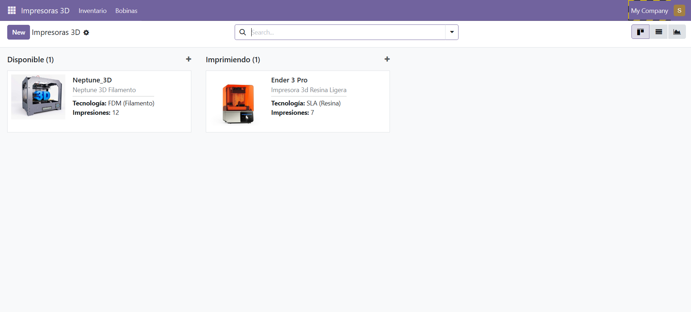
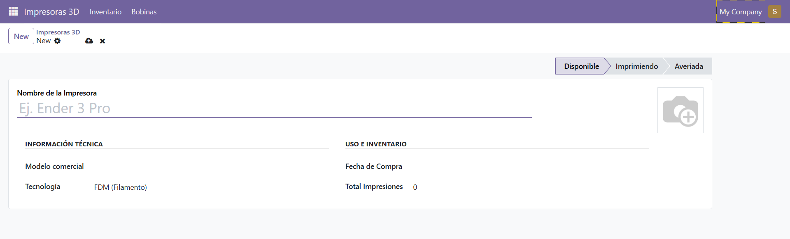
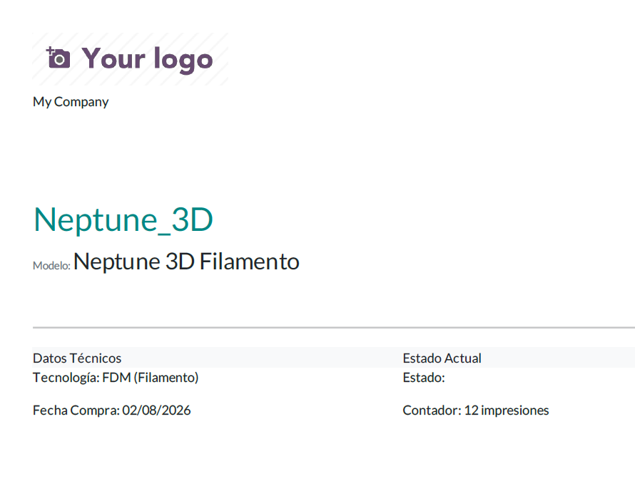

# Gestión de Impresoras 3D - Módulo para Odoo 19

Este proyecto tiene como objetivo crear un módulo para Odoo 19 que gestione el inventario, estado y consumibles de impresoras 3D.

Este proyecto ha sido desarrollado por **Diego, Roberto, Javier y Mario**.

## Índice
1. [Información General del Proyecto](#1-información-general-del-proyecto)
2. [Descripción de la empresa](#2-descripción-de-la-empresa)
3. [Funcionalidades Principales](#3-funcionalidades-principales)
4. [Estructura del Proyecto](#4-estructura-del-proyecto)
5. [Tecnologías Utilizadas](#5-tecnologías-utilizadas)
6. [Modelos de Datos](#6-modelos-de-datos)
7. [Vistas e Interfaz](#7-vistas-e-interfaz)
8. [Sistema de Reportes](#8-sistema-de-reportes)
9. [Seguridad y Permisos](#9-seguridad-y-permisos)
10. [Instalación y Configuración](#10-instalación-y-configuración)

---

## 1. Información General del Proyecto

### Descripción
**Gestión de Impresoras 3D** es un módulo personalizado para Odoo 19. Permite llevar un control exhaustivo del ciclo de vida de las máquinas, su estado operativo y el inventario de materiales (bobinas de filamento) asignados a cada una.

### Datos del Proyecto
* **Nombre del Módulo:** `gestion_impresoras`
* **Versión:** 1.1
* **Plataforma:** Odoo 19.0
* **Categoría:** Inventory / Manufacturing
* **Licencia:** LGPL-3
* **Tipo:** Módulo de Aplicación

### Contexto Académico
Este proyecto ha sido desarrollado como trabajo práctico de la asignatura **SGE (Sistemas de Gestión Empresarial)** del curso **2º DAM (Desarrollo de Aplicaciones Multiplataforma)**. Demuestra la capacidad de trabajar en equipo mediante control de versiones (Git/GitHub) y el desarrollo nativo en el framework de Odoo.

## 2. Descripción de la empresa

### Actividad
**Nova Parts 3D S.L.** es una empresa ubicada en Guadalajara dedicada a la impresión 3D de piezas personalizadas, orientada al sector B2B (ingeniería, automoción y prototipado rápido). Cuentan con un equipo de 15 empleados distribidos en Dirección, Diseño, Ventas y Producción.

### Necesidades detectadas
La empresa se enfrenta a graves problemas de organización diaria en su taller:
* **Descontrol de estados:** El Almacén y Producción no saben de un vistazo qué máquinas están imprimiendo, cuáles están libres y cuáles averiadas.
* **Falta de mantenimiento:** Se pierde el hilo de la carga de trabajo de cada máquina.
* **Caos de consumibles:** No hay un registro en tiempo real de qué material (bobinas de PLA, resinas) está asignado a qué impresora.

### Justificación del módulo
La empresa dispone de un presupuesto inicial de 3.000€ y necesita una solución web multiusuario. El desarrollo de este módulo para Odoo 19 se justifica porque centraliza el inventario físico (hardware) y los consumibles en una sola plataforma, permitiendo reducir errores, mejorar la trazabilidad y sentar las bases para una futura integración con los módulos de Ventas y Facturación de Odoo.

---

## 3. Funcionalidades Principales

### 1. Gestión del Parque de Impresoras
Permite registrar cada máquina con su fotografía, modelo, tecnología (FDM, SLA, SLS) y fecha de compra. Permite activar una alerta visual si la máquina requiere mantenimiento en base a su carga de trabajo.

### 2. Inventario de Bobinas (Materiales)
Un modelo secundario que actúa como almacén de consumibles. Permite registrar rollos de filamento, indicando su material (PLA, ABS, PETG, TPU), peso inicial (en gramos) y asignándolos de forma dinámica a una impresora operativa del sistema.
* **¿Por qué es importante?** Relaciona los gastos de material con el hardware, sentando las bases para una trazabilidad completa del taller.

### 3. Tablero Kanban de Producción
Visualización de las máquinas en tarjetas organizadas en columnas según su estado actual: *Disponible, Imprimiendo o Averiada*.
* **¿Por qué es importante?** Ofrece a los operarios del taller una vista rápida del estado del laboratorio, ideal para pantallas táctiles o tablets.

### 4. Gráficos de Análisis de Carga
Representación visual en diagrama de barras que agrupa el número total de impresiones realizadas por cada tecnología de impresión.
* **¿Por qué es importante?** Ayuda en la toma de decisiones (por ejemplo, si las máquinas FDM tienen mucha más carga que las SLA, conviene invertir más en FDM).

### 5. Generación de Fichas Técnicas PDF
Genera automáticamente un reporte profesional con los datos técnicos de la máquina y su estado actual. Diseñado para imprimirse y adherirse al chasis de las impresoras físicas.

---

## 4. Estructura del Proyecto

El código está organizado siguiendo la arquitectura MVC (Modelo-Vista-Controlador) estándar de Odoo:

```text
gestion_impresoras/
│
├── __init__.py                      # Inicialización del módulo Python
├── __manifest__.py                  # Configuración y metadatos del módulo
├── README.md                        # Documentación del proyecto
│
├── models/                          # Lógica de negocio (Backend)
│   ├── __init__.py                  # Importación de los modelos
│   ├── impresora.py                 # Modelo principal: impresion.impresora
│   └── bobina.py                    # Modelo secundario: impresion.bobina
│
├── views/                           # Interfaz de usuario (XML)
│   ├── impresora_view.xml           # Vistas core (Form, List, Kanban, Search) y menús
│   ├── bobina_view.xml              # Vistas para inventario de filamentos
│   └── impresora_graficos.xml       # Vista de análisis de datos (Graph)
│
├── report/                          # Plantillas de impresión
│   └── impresora_report.xml         # Diseño QWeb de la ficha técnica PDF
│
└── security/                        # Control de acceso
    └── ir.model.access.csv          # Permisos CRUD para los grupos de usuarios
```
## 5. Tecnologías Utilizadas

### Backend
* **Python 3.10+:** Lenguaje base para la lógica de negocio.
* **Odoo ORM:** Sistema de mapeo objeto-relacional para interactuar con la base de datos sin escribir SQL directo.
* **PostgreSQL:** Base de datos relacional subyacente.

### Frontend
* **XML:** Para la declaración de las vistas (interfaz de usuario) y acciones.
* **QWeb:** Motor de plantillas de Odoo para la generación del PDF.

### Herramientas de Desarrollo
* **Git y GitHub:** Control de versiones distribuido. Uso de ramas separadas (`rama_javier`, `rama_mario`, `rama_roberto`, `rama_diego`) para simular un entorno de trabajo real en equipo y posterior integración (Merge) a la rama `master`.

---

## 6. Modelos de Datos

### Modelo 1: `impresion.impresora`
Actúa como tabla maestra del hardware del laboratorio.
* **Tabla en BD:** `impresion_impresora`

| Campo | Tipo | Descripción | Requerido |
|-------|------|-------------|-----------|
| `name` | Char | Identificador/Nombre de la máquina | Sí |
| `modelo` | Char | Modelo específico (ej. Ender 3) | Sí |
| `tecnologia` | Selection | FDM, SLA, SLS | Sí |
| `foto` | Binary | Imagen de la impresora | No |
| `estado` | Selection | Disponible, Imprimiendo, Averiada | Sí |
| `num_impresiones` | Integer | Contador de trabajos realizados | No |
| `necesita_mantenimiento`| Boolean | Alerta técnica de revisión | No |

### Modelo 2: `impresion.bobina`
Gestiona el inventario de materiales consumibles y su asignación.
* **Tabla en BD:** `impresion_bobina`

| Campo | Tipo | Descripción | Requerido |
|-------|------|-------------|-----------|
| `name` | Char | Identificador (ej. PLA Rojo Mate) | Sí |
| `material` | Selection | PLA, ABS, PETG, TPU | Sí |
| `peso_inicial` | Integer | Gramos de material | No (Def: 1000) |
| `impresora_id` | Many2one | Relación con la impresora en uso | No |

**Relación:** Una impresora (`impresora_id`) puede tener asignadas múltiples bobinas a lo largo de su vida útil.

---

## 7. Vistas e Interfaz

* **Vista Formulario (Form View):** Interfaz dividida por secciones (`<group>`). Incorpora widgets avanzados como `statusbar` (para flujos de estado), `image` (para previsualizar fotos) y `boolean_toggle` (para activar alertas de mantenimiento).
* **Vista Lista (List View):** Tabla resumen optimizada mediante la nueva etiqueta `<list>` de Odoo 19. Incorpora decoradores condicionales (`decoration-success`, `decoration-danger`) que cambian el color de la fila según el estado de la máquina.
* **Vista Kanban:** Tarjetas dinámicas organizadas en columnas (`default_group_by="estado"`). Permite la gestión visual y ágil del parque de impresoras mediante "Drag & Drop".
* **Vista Búsqueda (Search):** Buscador avanzado con filtros rápidos ("Disponibles", "Averiadas", "Requiere SAT") para facilitar la navegación en inventarios grandes.
* **Vista Gráfico (Graph):** Representación en diagrama de barras (`type="bar"`) cruzando el número de impresiones totales con cada tecnología disponible.

---

## 8. Sistema de Reportes

### Ficha Técnica de Impresora (PDF)
* **Trigger:** Botón "Imprimir" en la vista de formulario o lista.
* **Proceso:** Odoo renderiza el template QWeb utilizando `<t t-call="web.external_layout">` para mantener el formato corporativo (logo, cabecera y pie de página).
* **Contenido:** Extrae y formatea dinámicamente el nombre, modelo, tecnología y la imagen de la impresora, preparado para su impresión física y uso en el taller.

---

## 9. Seguridad y Permisos

El archivo `security/ir.model.access.csv` garantiza los niveles de seguridad de la base de datos, evitando errores de acceso denegado ("Access Denied").

| ID | Nombre | Modelo | Grupo Odoo | Permisos (R,W,C,U) |
|----|--------|--------|------------|--------------------|
| `access_impresora` | `access.impresora` | `impresion.impresora` | `base.group_user` | 1, 1, 1, 1 |
| `access_bobina` | `access.bobina` | `impresion.bobina` | `base.group_user` | 1, 1, 1, 1 |

*(Se otorgan permisos completos de Lectura, Escritura, Creación y Borrado a los usuarios del grupo base).*

---

## 10. Instalación y Configuración

### Requisitos Previos
* Odoo 19.0 instalado localmente o en servidor.
* PostgreSQL funcionando.

### Pasos de Instalación
1. **Copiar el módulo:** Colocar la carpeta `gestion_impresoras` dentro del directorio `addons/` de tu servidor Odoo.
2. **Actualizar lista de aplicaciones:** * Entrar a Odoo.
   * Ir a **Ajustes** > Activar **Modo Desarrollador**.
   * Ir al menú de **Aplicaciones** > Hacer clic en **Actualizar lista de aplicaciones**.
3. **Instalar el módulo:** * En el buscador de aplicaciones (borrando el filtro por defecto), buscar "Gestión de Impresoras 3D".
   * Hacer clic en **Instalar**.
4. **Comenzar a usar:** * Navegar al nuevo menú principal "Impresoras 3D" para registrar tu primera máquina y sus bobinas asociadas.


## 11. Uso de Git

### Explicación del flujo de trabajo
Para el desarrollo de este módulo, hemos simulado un entorno de producción real utilizando Git. Hemos aplicado un flujo de trabajo basado en ramas (Branching):
1. **Ramas individuales:** Se crearon 4 ramas separadas (`rama_diego`, `rama_roberto`, `rama_javier`, `rama_mario`).
2. **Desarrollo aislado:** Cada miembro del equipo programó y probó su parte del código (modelos, vistas, seguridad) en su propia rama para no interferir con el trabajo del resto.
3. **Integración (Merge):** Una vez validadas las funcionalidades, el líder del proyecto realizó las fusiones (`git merge`) hacia la rama principal (`master` / `main`), resolviendo los conflictos de código de forma colaborativa.

---

## 12. Pruebas

### Instalación del módulo
La instalación se ha realizado con éxito en un entorno local de Odoo 19 sobre Windows y PostgreSQL, activando el modo desarrollador y actualizando la lista de aplicaciones.

### Funcionamiento general y Creación de registros
Se han realizado pruebas funcionales de todo el flujo (CRUD):
1. **Creación:** Se han registrado impresoras (ej. Prusa MK4, Ender 3) y bobinas (PLA, Resina).
2. **Relación:** Se ha comprobado que el campo `Many2one` asigna correctamente la bobina a la impresora.
3. **Vistas:** Se ha verificado el Drag & Drop en la vista Kanban y el filtrado en la vista List.
4. **Reportes:** Se han generado los PDF correctamente y los gráficos muestran los cálculos estadísticos.

### Capturas de Vistas y Menús
*(Añadir aquí capturas de pantalla del módulo funcionando).*




---

## 13. Conclusiones

### Aprendizajes
* **Arquitectura MVC en ERPs:** Hemos comprendido cómo Odoo separa la lógica (Python/PostgreSQL) de la interfaz (XML).
* **ORM de Odoo:** Hemos aprendido a crear tablas y relaciones (Many2one) sin necesidad de escribir sentencias SQL directas.
* **Trabajo en equipo:** El uso de Git con ramas nos ha enseñado a gestionar conflictos de código y coordinar el desarrollo.

### Dificultades
* **Versiones de Odoo:** La mayor dificultad técnica fue la migración de la vista `<tree>` (usada en versiones anteriores) a la nueva etiqueta `<list>` obligatoria en Odoo 19, lo cual nos obligó a depurar errores del servidor y leer la documentación oficial.
* **Generación de PDFs:** Configurar `wkhtmltopdf` en el entorno de desarrollo y lograr que el motor QWeb renderizara correctamente las imágenes binarias (`widget="image"`) en el documento final.

### Mejoras futuras
Como propuesta de mejora para siguientes fases de implantación en *Nova Parts 3D S.L.*, proponemos:
1. Conectar el módulo de Impresoras con el módulo de **Mantenimiento** nativo de Odoo para automatizar avisos técnicos.
2. Integrar el coste de las bobinas con el módulo de **Ventas**, para calcular automáticamente el coste de impresión por pieza para el cliente final.
